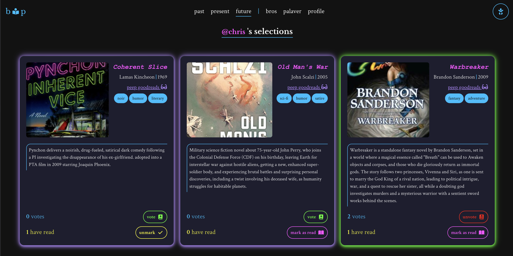
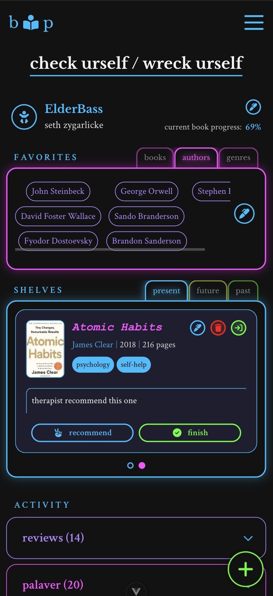

# BROS AND PROSE

```
 ██████╗ ██████╗  ██████╗ ███████╗     █████╗ ███╗   ██╗██████╗
 ██╔══██╗██╔══██╗██╔═══██╗██╔════╝    ██╔══██╗████╗  ██║██╔══██╗
 ██████╔╝██████╔╝██║   ██║███████╗    ███████║██╔██╗ ██║██║  ██║
 ██╔══██╗██╔══██╗██║   ██║╚════██║    ██╔══██║██║╚██╗██║██║  ██║
 ██████╔╝██║  ██║╚██████╔╝███████║    ██║  ██║██║ ╚████║██████╔╝
 ╚═════╝ ╚═╝  ╚═╝ ╚═════╝ ╚══════╝    ╚═╝  ╚═╝╚═╝  ╚═══╝╚═════╝
 ██████╗ ██████╗  ██████╗ ███████╗███████╗
 ██╔══██╗██╔══██╗██╔═══██╗██╔════╝██╔════╝
 ██████╔╝██████╔╝██║   ██║███████╗█████╗
 ██╔═══╝ ██╔══██╗██║   ██║╚════██║██╔══╝
 ██║     ██║  ██║╚██████╔╝███████║███████╗
 ╚═╝     ╚═╝  ╚═╝ ╚═════╝ ╚══════╝╚══════╝
```

_a desperate gambit for a few bros to appear inllectual and sophisticated_

[](https://vuejs.org/)
[](https://www.typescriptlang.org/)
[](https://firebase.google.com/)
[](https://vercel.com/)

> A website for the Bros and Prose book club. Five dudes, countless books, infinite shitty opinions.

---

## what's this about?

Bros and Prose is a website built for a very specific audience: our five-person book club consisting of Seth (yours truly), Chris, Ken, Joel, and Judd.

**What it does:** Tracks what we're reading, lets us vote on what's next, keeps tabs on everyone's personal library, and provides a dedicated space to talk shit about books (respectfully, of course).

**Why it exists:** Because group texts are chaos, Goodreads is too public, and spreadsheets are for cowards.

**The vibe:** Neon cyberpunk aesthetic meets "your friend's brutally honest book recommendation."

---

## features

### 📖 present: where you actually are in the book

Track progress on the current book club selection:

-   Update how far you've gotten (in pages, because we're not savages)
-   Add notes and thoughts as you go
-   See where the other bros are (and judge them accordingly)
-   Share commentary on specific sections

No more "wait, what page are we on?" nonsense.


_Track your progress and see where the bros are at_

---

### 📚 past: the receipts

Browse the complete history of what we've read:

-   Every book we've suffered through (and loved)
-   Ratings and reviews from all members
-   Consensus scores and memorable quotes

Great for settling arguments about "that book we read two years ago."


_See what everyone thought about it_

---

### 🔮 future: democracy in action (sort of)

When it's your turn to pick, nominate three books. The bros vote.

**Key features:**

-   Current selector uploads 3 nominations
-   Everyone else votes for their favorite
-   Mark books you've already read (triggers email: _"has, allegedly, already read... Cheeky fuck."_)
-   Real-time vote tracking
-   Visual indicators for who's being honest about having read what

**Already Read Feature:** The pettiest feature in the app. When you mark a book as "already read," everyone gets an email notification. If you *un*mark it? Everyone gets another email: _"is an idiot and remembered he hasn't read..."_

It's transparency through public shaming.


_Vote on what's next, mark what you've read_

---

### 💬 palaver: the feed

A dedicated space for book club discourse:

-   Share progress updates on the current book
-   Drop discussion notes and thoughts
-   Write and share full reviews
-   Recommend books (for personal reading, not book club)
-   Suggest app features (meta, I know)
-   React with likes/dislikes
-   Comment on other bros' entries

Plus email notifications for all activity, because FOMO is real.

**Entry types:**

-   Discussion notes (book-specific thoughts)
-   Progress notes (milestone updates)
-   Reviews (full ratings and commentary)
-   Recommendations (books you think the bros should read)
-   Suggestions (app features or improvements)
-   Miscellaneous (everything else)


_The social feed for book talk_


_Just look at that juicy discussion, oh my_


_Because we all need more notications to check, obvi_

---

### 👤 your profile: your literary identity

**Personal Bookshelves:**

Three color-coded shelves for organizing your reading life:

-   **Currently Reading** (blue) - what you're in right now
-   **Want to Read** (yellow) - your aspirational pile of shame
-   **Have Read** (green) - your accomplishments and/or receipts

Each shelf is fully manageable: add books, edit details, write reviews, tag with genres.

**Favorites System:**

Curate your literary identity with favorite authors, genres, and books. Tabbed interface keeps it clean.

**Special sauce:** Favorite books directly from your "Have Read" shelf with a heart icon. First-time visitors get a wizard-guided onboarding that's equal parts helpful and charming.

**The Copy:**

-   Profile header: "check urself / wreck urself"
-   Favorites intro: "save your favs" (with options like "hell yeah" and "fuck right off")
-   Empty states: "no bro has previously perused this prose"


_Your literary identity: favorites and color-coded shelves_


_First-time onboarding wizard for adding favorites_

---

### 🤝 bros: the roster

See what the crew is up to:

-   View all book club members
-   Click through to any bro's profile
-   Browse their bookshelves and favorites
-   See their book club participation

When viewing someone else's profile, you get: "checking out @username"

Full transparency, respectfully stalking encouraged.

---

## the tech

**Frontend:**

-   Vue 3 (Composition API because we're not stuck in 2019)
-   TypeScript (type safety is self-care)
-   Vuetify (Material Design, but make it cyberpunk)
-   Pinia (state management that doesn't suck)
-   FontAwesome (icons on icons)
-   Vite (build tool that's actually fast)

**Backend:**

-   Node.js + Express
-   TypeScript (yes, here too)
-   Firebase Realtime Database (real-time updates, baby)
-   Firebase Admin SDK
-   Mailjet (email notifications with personality)

**Infrastructure:**

-   Vercel (frontend deployment)
-   Render (backend hosting)
-   Firebase (real-time sync and auth)

**The Special Sauce:**

-   Real-time listeners for live updates
-   Custom CSS variables for neon theme
-   Modular component architecture
-   Email notifications that actually make you smile

---

## features worth mentioning

**The Already Read System:**

Public accountability through email notifications. Mark a book as read? Everyone knows. Change your mind? Everyone knows that too.

**Email Personality:**

Our notification emails aren't corporate garbage. Examples:

-   "voted for future book nom"
-   "has, allegedly, already read... Cheeky fuck."
-   "is an idiot and remembered he hasn't read"

**Color-Coded Organization:**

Visual theming for bookshelves (blue/yellow/green) with matching glows and borders. It's pretty _and_ functional.

**Favorites Wizard:**

First-time users get a guided multi-step form. Can be dismissed with "fuck right off" or postponed with "remind me later" (reappears after 24 hours).

**Real-Time Everything:**

Firebase listeners mean when someone votes, you see it. No refresh needed. It's 2026, we're not animals.

**Responsive Design:**

Works on mobile. Desktop is preferred but we're not gatekeeping.


_Responsive design for on-the-go reading_

---

## running it locally

This is a private project, but here's how it works:

```bash
# clone it
git clone https://github.com/elderbass/bros-and-prose.git
cd bros-and-prose

# backend setup
cd backend
npm install
# create .env with:
# - FIREBASE_SERVICE_ACCOUNT
# - MAILJET_API_KEY
# - MAILJET_API_SECRET
# - MAILJET_FROM_EMAIL
# - EMAIL_RECIPIENTS

# frontend setup
cd ../frontend
npm install

# run both
cd ../backend
npm run start:dev  # runs backend + frontend concurrently
```

**Backend:** `http://localhost:3000`  
**Frontend:** `http://localhost:5173`

---

## how it's organized

```
bros-and-prose/
├── frontend/
│   └── src/
│       ├── components/     # feature-based organization
│       │   ├── features/   # CurrentBook, FutureBooks, Palaver, etc.
│       │   ├── form/       # reusable form components
│       │   ├── layout/     # app structure
│       │   ├── modal/      # modal dialogs
│       │   ├── ui/         # base UI components
│       │   └── views/      # page-level components
│       ├── composables/    # reusable Vue logic
│       ├── stores/         # Pinia state management
│       ├── services/       # API wrappers
│       ├── types/          # TypeScript definitions
│       └── utils/          # helper functions
└── backend/
    ├── routes/             # Express endpoints
    ├── mailjet/            # email templates
    └── db/                 # Firebase config
```

Modular, type-safe, and surprisingly maintainable for a side project.

---

## how this got built

This app was built incrementally based on actual needs:

-   Started with basic progress tracking
-   Added features as we needed them
-   Prioritized UX and personality over perfection
-   Deployed frequently, broke things occasionally
-   Iterated based on group feedback

It's a living project that grows with the book club.

---

## check out the aesthetic

_Neon cyberpunk meets book club software_

The app features a custom dark theme with neon accents (blue, fuschia, yellow, green, lavender, pink) that give it a distinct cyberpunk vibe. Every interaction feels intentional, from the glowing tab borders to the animated transitions.

---

## contributing

This is a private project for our book club, so we're not accepting PRs. But feel free to:

-   Browse the code
-   Steal ideas for your own project
-   Reach out if you want to talk about the tech

We built this for us, but we're happy to share what we learned.

---

## license

Private project. Don't steal our exact app, but the concepts are fair game.

---

## shoutouts

Built by Seth for the Bros and Prose book club.

**The Bros:**

-   Seth (me, the builder)
-   Chris Dub
-   Ken McGurran
-   Joel Braxton
-   Judd Prasnicky

**Tech that made it possible:**

-   Vue.js team
-   Firebase
-   Vercel & Render
-   Every Stack Overflow answer at 2am

**Inspiration:**

-   Neon cyberpunk aesthetics
-   The need for better group organization
-   A healthy disdain for group chats

---

_"God's plan..." - Drake_

_"Books are mirrors: you only see in them what you already have inside you." - Carlos Ruiz Zafón_

...but sometimes you need an app to keep track of it all.
